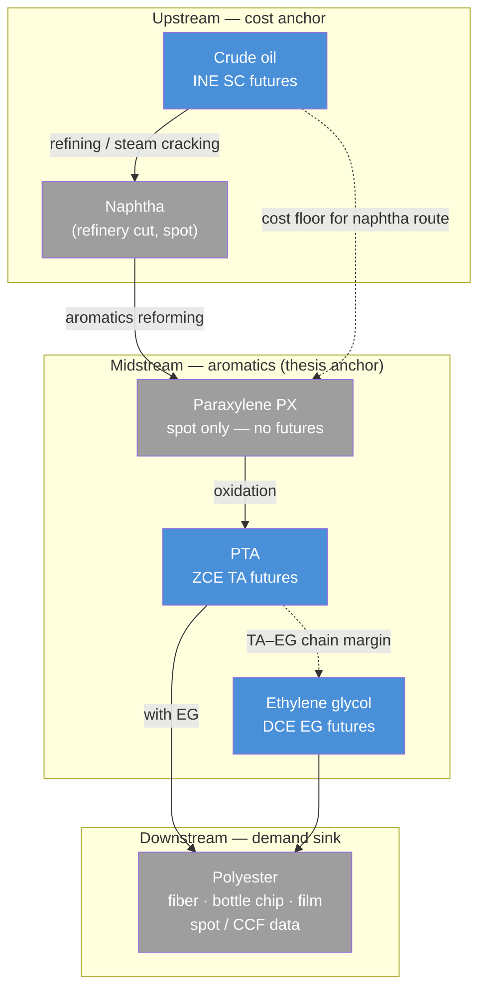
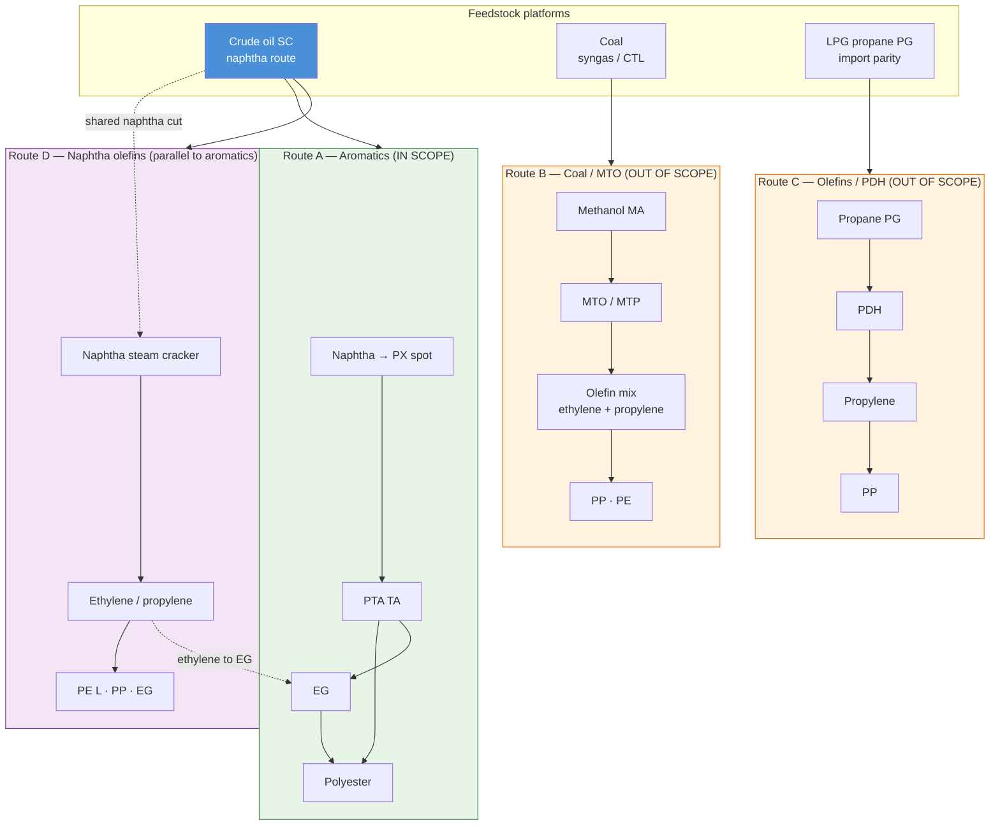

> **Stage 1 freeze (China-sc-crude-oil-research):** Layer 1 + BVAR shipped on GitHub. Layers 2–5 deep dive archived in local `backup/research/value_chain_layers234.md`.

# China Aromatics Value Chain — SC → TA → EG

**As-of:** 2026-06-23 | **Anchor:** Combo B (aromatics) | **Thesis ref:** `notes/thesis_one_pager.md`

---

## 1. Executive chain summary

- **Layer 1 (SC crude) — complete for deck:** China imports **~72%** of refinery feedstock (2024 EIA); weekly CDU utilization **57.5%** (2026-06-18 OilChem), **−15.8pp** vs pre-shock baseline. SC trades **−2.7 USD/bbl** vs Brent (z = −1.0) with **backwardation** (−2.5 CNY front→6M) — landed cost discount + tight near-term physical, consistent with run-cuts not storage build.
- *Layers 2–5 out of scope for Stage 1 repo — see local `backup/`.*

---

## 2. Chain diagram

### 2.1 Primary path (thesis scope): crude → polyester

**Legend:** Blue = liquid China futures (SC, TA, EG). Gray = spot-only or no liquid future.

### 2.2 Alternative routes (out of thesis scope — Q&A / appendix)

China petrochemicals converge on **downstream polymers** through three major feedstock platforms. Your aromatics path (top) competes with coal and LPG routes for overlapping end products.

**Where alternatives “kick in”:**

| Junction             | Primary path (aromatics)  | Alternative                                       | Why it matters                                                                                      |
| -------------------- | ------------------------- | ------------------------------------------------- | --------------------------------------------------------------------------------------------------- |
| After crude          | Naphtha → **PX → PTA**    | Same naphtha → **steam cracker → ethylene**       | One barrel splits between aromatics and olefins; refinery optimization shifts PX vs ethylene yields |
| PTA + EG → polyester | **TA + EG** (thesis)      | Coal **MTO** can also supply olefins → some EG/PP | Coal route is margin-driven off domestic coal, not Brent                                            |
| Downstream polymer   | Polyester (fiber, bottle) | **PP / PE** from MTO or PDH                       | Packaging and textile substitutes; different futures (PP, L)                                        |
| Propylene / PP       | Not on aromatics path     | **PG → PDH → PP**                                 | Import propane arb; competes with naphtha and MTO for PP supply                                     |

---

## 3. Layer skeleton — Step 1 chain table

| Layer | Node             | Primary feedstock                        | Key China hubs                                                    | Listed players                                                        | Futures contract                  |
| ----- | ---------------- | ---------------------------------------- | ----------------------------------------------------------------- | --------------------------------------------------------------------- | --------------------------------- |
| 1     | **Crude**        | — (imported)                             | Import ports; INE delivery storage (coastal bonded tanks)         | PetroChina, Sinopec, CNOOC; independent refiners (Shandong, Liaoning) | **SC** (INE)                      |
| 2     | **Naphtha / PX** | Crude / condensate                       | Integrated coastal refineries: Dalian, Zhoushan/Zhejiang, Jiangsu | Hengli, Rongsheng (ZPC), Sinopec, PetroChina                          | Spot only (no PX future)          |
| 3     | **PTA**          | PX                                       | Zhejiang, Jiangsu (Shaoxing, Ningbo corridor)                     | Hengli, Rongsheng, Tongkun (桐昆), Hengyi (恒逸)                          | **TA** (ZCE)                      |
| 4     | **EG**           | Ethylene (naphtha cracker) or coal-to-EG | Coastal plants + import ports (华东)                                | Same integrators; standalone EG units                                 | **EG** (DCE)                      |
| 5     | **Polyester**    | PTA + EG                                 | Zhejiang / Jiangsu textile belt                                   | Tongkun, Hengyi, Rongsheng                                            | No liquid future (CCF / SCI spot) |

---

## 4. Layer-by-layer deep dive (TOP → BOTTOM)

### 4.1 Layer 1 — Crude (SC)

#### Layer 1 — completed data pulls ✓

| Item | Result | As-of | Script / data |
| ---- | ------ | ----- | --------------- |
| SC term structure (front vs ~6M) | **Backwardation** −2.5 CNY/bbl (SC2608→SC2702) | 2026-06-22 | `code/sc_term_structure.py` |
| SC–Brent basis + z-score | **−2.7 USD/bbl** (z = **−1.0** vs 3y) | 2026-06-22 | `code/sc_basis.py` |
| China crude imports / runs (annual) | Imports **11.1 Mb/d**, runs **14.2 Mb/d**, import dep. **72%** | 2024 | `code/china_crude_supply_demand.py` |
| Refinery CDU utilization (weekly) | **57.54%** all-refinery; **43.47%** independent | 2026-06-18 | `code/fetch_refinery_utilization.py` |
| EIA cache refresh workflow | `EIA_API_KEY` + `EIA_FORCE_REFRESH=1` | — | `fetch_market_data.refresh_eia_china_crude_caches()` |

---

**SC** is the ticker for **medium sour crude oil futures** listed on the **Shanghai International Energy Exchange (INE)** — China's international energy derivatives venue (affiliated with SHFE). Key characteristics:

| Attribute              | Detail                                                                                                                                                                                                           |
| ---------------------- | ---------------------------------------------------------------------------------------------------------------------------------------------------------------------------------------------------------------- |
| **Full name**          | INE crude oil futures                                                                                                                                                                                            |
| **Symbol**             | SC                                                                                                                                                                                                               |
| **Listed**             | **26 March 2018** — first mainland commodity contract open to **overseas investors**                                                                                                                             |
| **Quote**              | **CNY per barrel** (RMB/bbl), net of tax/duty in quotation                                                                                                                                                       |
| **Contract size**      | **1,000 barrels / lot**                                                                                                                                                                                          |
| **Tick size**          | 0.1 CNY/bbl                                                                                                                                                                                                      |
| **Daily limit**        | ±4% vs prior settlement                                                                                                                                                                                          |
| **Settlement**         | **Physical delivery** into INE-designated **bonded storage** along the coast                                                                                                                                     |
| **Quality**            | Medium sour benchmark spec: **API 32.0°, sulfur 1.5% wt**                                                                                                                                                        |
| **Deliverable grades** | Middle East and other seaborne sour streams (e.g. Dubai, Oman, Basrah Light/Medium, Upper Zakum, Shengli domestic) — exchange publishes premia/discounts                                                         |
| **Contract months**    | 12 consecutive months + 8 quarterly months                                                                                                                                                                       |
| **Economic role**      | China is the world's largest crude **importer**; SC is intended as an **Asia–China landed-cost benchmark** vs Brent (offshore) and WTI (US), incorporating **CNY**, freight, port logistics, and domestic policy |

**Why SC matters for this thesis:** SC is not a generic global oil price — it proxies **China import landed cost** (FX + logistics + INE microstructure). That is the cost floor for coastal **naphtha** and thus the aromatics chain (PX → TA → EG), distinct from coal/MTO or PDH routes.

**Official refs:** [INE SC product page](https://www.ine.cn/eng/market/futures/energy/sc/) · [Contract text](https://www.ine.cn/eng/market/futures/energy/sc/contract/)

---

#### History of China's crude oil quote / benchmark price

China did **not** have a continuous domestic crude futures benchmark before 2018. Research and models must splice **offshore proxies** (Brent) with **SC** post-listing. Project implementation: `data/build_oil_splice.py` → `data/oil_price_splice_1973_2025.csv` (sample from **1987-05**).

##### Timeline

| Period           | Benchmark used                                                 | Notes                                                                                                    |
| ---------------- | -------------------------------------------------------------- | -------------------------------------------------------------------------------------------------------- |
| **Pre-1993**     | No active crude futures                                        | Nanjing Oil Exchange experimented 1992; exchanges shut 1993–94                                           |
| **1993–2017**    | **Offshore benchmarks** (Brent, Dubai/Oman for term contracts) | Refiners and traders hedged via **Brent/Dubai** swaps and forwards; no onshore crude future              |
| **2004–2018**    | SHFE **fuel oil** (FU) only                                    | Partial downstream hedge; not crude                                                                      |
| **2013–2017**    | INE established; crude listing prepared                        | CSRC approved INE 2013; overseas-trader rules 2015–17                                                    |
| **26 Mar 2018**  | **SC listed**                                                  | Yuan-denominated, physically delivered; marketed as potential third global benchmark alongside Brent/WTI |
| **2018–present** | **SC** for onshore hedge + **Brent/Dubai** for offshore        | SC–Brent basis reflects FX, freight, inventory, policy; BVAR uses spliced **real** price series          |

##### Pre-2018 price quote (research series)

For econometric work (`rpo_sc`), nominal price = **FRED Brent** (`MCOILBRENTEU`, USD/bbl), deflated by **US CPI** (`CPIAUCSL`).

| Milestone           | Brent nominal (USD/bbl) | Context                            |
| ------------------- | ----------------------- | ---------------------------------- |
| 1987 (series start) | ~$18                    | Post-1986 glut                     |
| 2008-07             | ~$134                   | Pre-GFC peak                       |
| 2014-06             | ~$112                   | Pre-shale / OPEC+ regime           |
| 2016-01             | ~$31                    | Cycle trough                       |
| 2017-12             | **$64.37**              | Last month before SC era in splice |

##### Post-2018 price quote (SC era)

From **2018-03** (first SC trading month in splice), nominal price = **INE SC main continuous** (CNY/bbl) converted to USD via **CNY/USD** (`DEXCHUS`). Real price deflated by **China CPI** (`CHNCPIALLMINMEI`). Jan–Feb 2018: **Brent bridge** until SC history available.

| Milestone              | SC nominal (CNY/bbl) | SC ≈ USD/bbl | Context                                          |
| ---------------------- | -------------------- | ------------ | ------------------------------------------------ |
| 2018-03 (launch month) | 420.3                | ~66.5        | First full SC month in splice                    |
| 2018-10                | 535.1                | ~77.3        | Pre-trade-war volatility                         |
| 2020-04                | 229.0                | ~32.4        | COVID demand shock (SC splice low)               |
| 2022-03                | 675.1                | ~106.4       | Post-Ukraine geopolitical premium                |
| 2024-12                | 559.9                | ~76.9        | Recent splice month                              |
| 2025-12                | 432.2                | ~61.4        | Latest month in `oil_price_splice_1973_2025.csv` |

**Splice rule (BVAR):** Brent through **2017-12** → SC USD from **2018-01** → `rpo_sc = 100 × ln(real price)`. Level shift at 2018 is expected (different deflator + market); absorbed by VAR intercept. See `notes/bvar_data_sources.md`.

**Deck footnote:** Pre-2018 charts labeled *"Brent proxy (FRED MCOILBRENTEU)"*; post-2018 *"INE SC continuous (CNY), akshare SC0"*.

---

#### Layer 1 research questions

*Leave blank during initial pass — fill in Phase 2–3.*

1. China crude import dependence (% consumption imported):
  **~72%** of crude supply to refineries is imported (2024: 11.1 Mb/d imports vs 4.3 Mb/d domestic production; EIA). Total liquids consumption ~16.3 Mb/d — see `data/china_crude_supply_demand_summary.json`.
2. How SC relates to Brent/Dubai (basis drivers: FX, freight, inventory, policy):
  **2026-06-22:** SC ≈ **75.0 USD/bbl** vs Brent **77.7** → basis **−2.7 USD/bbl** (z = **−1.0** vs 3y); vs Dubai spot **−27.3 USD** (Dubai monthly, stale). Drivers: CNY/USD **6.76**, near-term backwardation, Brent daily via ICE proxy. See `data/sc_basis_summary.json`.
3. Who sets the cost floor for naphtha/aromatics?
  Coastal **SC landed cost** (CNY futures + FX + INE microstructure) → refinery margin → **naphtha cut** opportunity cost. SC2608 settle **510.5 CNY/bbl** (2026-06-22).

---

#### Layer 1 fact table

| Item                         | Detail                                                                                                                                                                                                                                                                                        |
| ---------------------------- | --------------------------------------------------------------------------------------------------------------------------------------------------------------------------------------------------------------------------------------------------------------------------------------------- |
| **Process / products**       | Imported seaborne crude → coastal refineries → cuts include **naphtha** (light distillate) for petrochemical feedstock. Crude is not consumed directly by PTA plants; it sets the **opportunity cost** of naphtha vs fuel products.                                                           |
| **China capacity & imports** | China is the **largest crude importer** globally (surpassed US imports ~2017). **2024:** imports **11.1 Mb/d**, domestic production **4.3 Mb/d**, refinery runs **14.2 Mb/d**; import dependence **~72%** (EIA). Script: `code/china_crude_supply_demand.py`. |
| **Key hubs & players**       | **Import / delivery:** coastal bonded tanks (INE delivery ports — Shandong, Liaoning, Zhejiang coast per exchange rules). **Majors:** PetroChina (中石油), Sinopec (中石化), CNOOC. **Independents:** Shandong "teapot" refiners — active SC participants per launch reporting (Reuters, Mar 2018). |
| **Cost / margin drivers**    | Global crude supply (OPEC+), geopolitical risk premia, **USD/CNY**, freight, refinery utilization, government crude import quotas / stockpiling policy. Pass-through to naphtha is refinery-margin-dependent, not 1:1.                                                                        |
| **Cycle positioning**        | **Sharp run-cut phase** (2026-06-18): all-refinery CDU utilization **57.54%** (−0.89pp WoW, **−15.84pp** vs pre-conflict baseline 73.38% on 2026-02-26). Independent teapots **43.47%**; megaprojects **59.23%**. Aligns with annual EIA picture (2024 runs −4.1% YoY). Source: OilChem via `data/china_refinery_utilization_summary.json`. |
| **Futures: SC**              | Exchange: **INE**. Size: 1,000 bbl. Physical delivery. Dominant participants: physical refiners + global merchants (Glencore, Trafigura, Mercuria reported at launch).                                                                                                                        |
| **Basis vs spot**            | **2026-06-22:** SC **507.2 CNY/bbl** (≈ **75.0 USD/bbl**) vs Brent **77.7 USD/bbl** → basis **−2.7 USD/bbl** (**−3.5%**, z = **−1.0** vs 3y). Dubai spot (monthly FRED) **102.3 USD** → wider discount (monthly staleness). Data: `data/sc_basis_summary.json`; script: `code/sc_basis.py`. |
| **Term structure**           | **2026-06-22:** Front **SC2608** 510.5 vs **SC2702** 508.0 → spread **−2.5 CNY/bbl** (**backwardation**; ann. roll **−1.0%**). Low storage incentive at INE delivery sites. Data: `data/sc_term_structure_summary.json`. |
| **Cross-contract spreads**   | **SC–Brent** (China channel); SC–LU fuel oil (refining margin proxy, secondary). Aromatics linkage is indirect via naphtha/PX cost.                                                                                                                                                           |
| **China idiosyncrasy**       | **CNY-denominated** pricing; bonded delivery; import quota system; strategic petroleum reserve; SC liquidity grew quickly but **international benchmark status** still debated (Oxford Energy, IMA 2019).                                                                                     |
| **Key metrics (dated)**      | See table below — Layer 1 metrics complete; Layers 2–5 pending.                                                                                                                                                                                                                               |

##### Key metrics

| Metric                          | Value | As-of   | Source                                              | Status                      |
| ------------------------------- | ----- | ------- | --------------------------------------------------- | --------------------------- |
| SC continuous close (CNY/bbl)   | 507.2 | 2026-06-22 | `data/sc_basis_summary.json` (akshare SC0)         | ✓ daily pull                |
| SC ≈ USD/bbl (implied)          | 75.0  | 2026-06-22 | SC0 / FRED DEXCHUS                                 | ✓ daily pull                |
| Brent nominal (USD/bbl)         | 77.7  | 2026-06-22 | akshare OIL (ICE Brent proxy)                      | ✓ daily pull                |
| SC–Brent basis (USD/bbl)        | −2.7  | 2026-06-22 | `data/sc_basis_summary.json`                       | ✓ z = −1.0 (3y)             |
| China crude imports (Mbpd)      | 11.1  | 2024       | EIA International / `china_crude_imports_refining.csv` | ✓ annual                 |
| INE SC open interest            | 50,948| 2026-06-22 | Front SC2608 OI (`sc_term_structure_summary.json`) | ✓ front-month OI            |
| CNY/USD                         | 6.763 | 2026-06-12 | FRED DEXCHUS (latest in basis panel)               | ✓ (lags 10d vs SC)          |
| Refinery operating rate (China) | 57.54 | 2026-06-18 | OilChem CDU util. (`china_refinery_utilization.csv`) | ✓ weekly (curated) |
| Refinery util. — independent  | 43.47 | 2026-06-18 | OilChem (地炼)                                       | ✓ weekly (curated) |
| Refinery util. vs baseline    | −15.84pp | 2026-06-18 | vs 2026-02-26 pre-shock (73.38%)                 | ✓                 |

---
